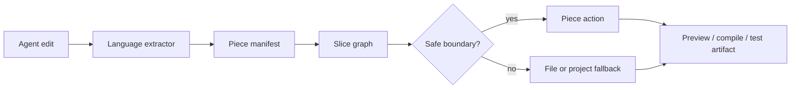

# Piece

[](https://github.com/phodal/piece/actions/workflows/pages.yml)

Build feedback at the size AI agents actually edit.

Piece turns a source file into a graph of functions, classes, types, components, and other semantic pieces. After an agent changes code, Piece can answer the questions that matter:

- which piece changed?
- what downstream pieces are affected?
- which preview, compile, test, or validation artifacts can be reused?
- when should the system fall back to a file-level or project-level build?

Try the live demo: [phodal.github.io/piece](https://phodal.github.io/piece/)

## The Idea

Traditional build systems think in files, targets, actions, and artifacts. That model is still useful, but agent edits are usually smaller than a file. Piece keeps the Bazel-style discipline and moves the inner-loop target boundary down to the semantic piece.

```text
source file
  -> semantic pieces
  -> impact graph
  -> smallest safe feedback action
  -> reusable artifact or fallback
```

Piece keeps the source file as the storage boundary and makes semantic pieces the feedback boundary.

## Why It Matters

For an editor, preview host, or coding agent, a full rebuild is often too slow and too vague. Piece creates a structured middle layer between language tools and existing build systems:

- faster feedback for small edits;
- explicit dependency and impact reasoning;
- cacheable artifacts tied to piece targets;
- honest fallback when local safety cannot be proven.

Piece is not a replacement for TypeScript, Go, Kotlin, Gradle, Vite, esbuild, or test runners. It is the coordination layer that helps them answer smaller questions.

## How It Works



The core vocabulary is intentionally small:

- `PiecePackage`: the file-level package that owns targets.
- `PieceTarget`: a function, class, type, component, value, or generated DSL target.
- `PieceAction`: the feedback action for a target, such as preview, analysis, compile, or test.
- `PieceArtifact`: the output that can be reused or invalidated.

## What Works Today

- A language-neutral package, target, action, artifact, graph, fallback, and cache model in `src/core/`.
- JavaScript, TypeScript, JSX, and TSX extraction, plus browser preview feedback with virtual modules, browser-safe single-declaration incremental extraction, and rebuild metrics.
- JS/TS compile actions through a Node-hosted esbuild language rule, so React and TSX are adapters, not the product boundary.
- Go extraction through a Node-hosted Go AST analyzer, package-local companion graph edges, safe package-scope selection, package-view `.pic` output, `go list -json` identity, and same-package `go build` / `go test` feedback.
- Kotlin analysis through the JVM backend, with PSI, guarded Analysis API coverage, Gradle/KMP project-model discovery, source-set fallback metadata, and Gradle-backed JVM compile feedback.
- Generated and override `.pic` metadata parsed by an ANTLR-backed JVM parser for the same package, target, action, artifact, source, and cacheKey model.
- Local action-cache records for Go, Kotlin, JavaScript, and TypeScript compile actions, exposed through `compilePieceAction()` and `compilePieceApp({ compileAction: true })`.
- Opt-in `actionCacheMode: "reuse-local"` artifact reuse from a content-addressed local artifact store, with SHA-256 content hashes and filesystem validation before any backend is skipped.
- Safety gates for feedback fallback, Gradle project-model fallback, unsafe package/source-set promotion, missing artifact ids, missing cache keys, missing cached files, and mismatched cached file metadata.
- Snapshot reconciliation for changed pieces, dirty propagation, reused artifacts, and invalidated artifacts.

React is just one adapter. JS/TS, Go, Kotlin, and `.pic` metadata share the same manifest, graph, action, and artifact model.

## GitHub Pages Demo

The hosted demo runs the browser-safe path: TSX piece extraction, piece preview bundling with `esbuild-wasm`, incremental closure metrics, and a Kotlin/Wasm core smoke page. Local compile actions, action-cache stores, Go tooling, and Kotlin/JVM or Gradle execution stay in the Node/JVM host path and are verified by the local smoke commands.

## Try It Locally

```sh
npm install
npm run preview
```

Open `http://127.0.0.1:8797` and use `Sample Edit` to watch a piece-level update rebuild only the affected preview path.

To exercise the local compile and action-cache path across Go, Kotlin, and JS/TS:

```sh
npm run language:compile:smoke
```

## Package Availability and ESM

Piece is ESM-only. Use `import` with Node.js 20 or newer; CommonJS `require()`
is not a supported package entrypoint.

The repository can always be installed from a local checkout or tarball. A
public `npm install piece-compiler` release is available only after the
repository owner configures npm package ownership and a Trusted Publisher for
this repository, then publishes a verified tag. The GitHub workflow can request
an OIDC token, but npm Trusted Publisher setup remains an external npm account
configuration. Check the package registry or a tagged release before depending
on that package name in automation.

When a published version is available, use it as ESM:

```sh
npm install piece-compiler
```

```js
import { createPieceCompiler } from "piece-compiler";
```

## CLI: Safe Single-File Analysis

The initial `piece` CLI is a production-oriented feedback surface for analyzing
one source file. It intentionally does **not** claim to build or watch an
entire workspace yet.

From a local checkout, run `node bin/piece.js`; from an installed tarball or
published release, run `npx piece`:

```sh
node bin/piece.js analyze src/App.tsx --format json
npx piece doctor
```

`--workspace <path>` selects the workspace root, and `--no-color` makes human
output suitable for logs. Human output goes to stderr; `--format json` writes a
single stable `schemaVersion: 1` result to stdout.

| Exit code | Meaning |
| --- | --- |
| `0` | Successful analysis or doctor report. |
| `1` | Analysis failed or returned an error diagnostic. |
| `2` | Invalid CLI usage, configuration, or workspace-contained path. |
| `4` | Infrastructure failure such as an unreadable workspace or config. |

The only configuration filename is `piece.config.json`, located inside the
workspace. Its first schema is intentionally narrow and rejects unknown keys:

```json
{
  "schemaVersion": 1,
  "entry": "src/App.tsx",
  "sourceRoots": ["src"],
  "globals": ["console"],
  "packageScopeSelection": "safe",
  "sourceSetScopeSelection": "safe"
}
```

All config and entry paths must remain inside the selected workspace. The JSON
result records whether the workspace, configuration, entry, and source roots
came from a flag, argument, config, or default.

## Repository Map

```text
src/
  core/                 manifest, graph, closure, reconcile, package model
  languages/            JS/TS, Kotlin, and Go extractors
  adapters/react/       React preview adapter
  node-language-compilers.js
                        Go, Kotlin, JS/TS compile action dispatch

piece-core/
  src/commonMain/       Kotlin MPP model, DSL, graph, reconcile contracts
  src/jvmMain/          Kotlin PSI, diagnostics, Gradle project model, compile backend
  src/jsMain/           npm-facing bridge
  src/wasmJsMain/       browser smoke bridge

grammar/
  Piece.g4              .pic grammar consumed by the JVM ANTLR backend

docs/
  architecture.md       design model and single-file Bazel mapping
  roadmap.md            Kotlin and .pic roadmap
```

## Development

Use the small checks while iterating:

```sh
npm run typecheck
npm test
npm run preview:build
```

Use the full verification gate before shipping:

```sh
npm run verify
npm run core:check
npm run language:analysis:smoke
npm run language:compile:smoke
npm run pages:build
```

Before a manual npm publish, run the same release boundary that npm executes
through `prepublishOnly`:

```sh
npm run release:verify
```

It verifies source tests, installs and probes the packed tarball (including the
CLI), and runs the Go/Kotlin/DSL language smoke suite. Do not use
`npm publish --ignore-scripts`, which bypasses this local release gate.

For the deeper architecture and roadmap, see [docs/architecture.md](./docs/architecture.md), [docs/incremental-feedback-architecture.md](./docs/incremental-feedback-architecture.md), and [docs/roadmap.md](./docs/roadmap.md).

## License

Apache-2.0. See [LICENSE](./LICENSE).
