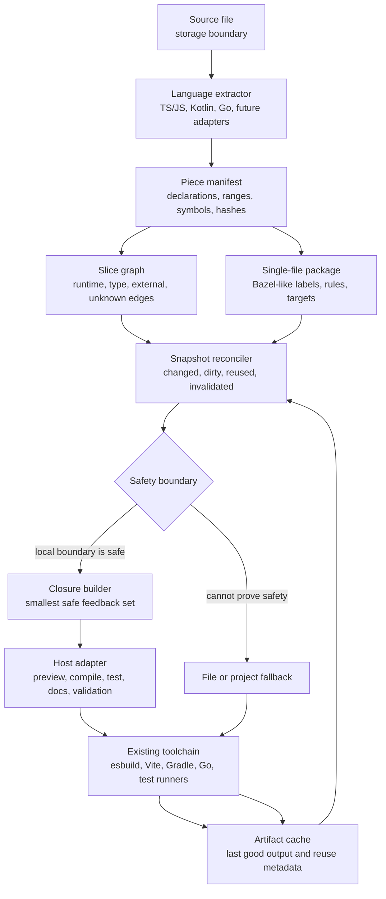

# Piece

[](https://github.com/phodal/piece/actions/workflows/pages.yml)

Piece is a piece-aware build feedback layer for AI-era coding agents.

Files remain the storage boundary. Piece makes functions, classes, types, components, values, and other semantic pieces the feedback boundary. After an agent edit, it asks a more useful set of questions than "which file changed?": which piece changed, whether its public shape changed, what downstream pieces are affected, which artifacts can be reused, and when the system must fall back to a file-level or project-level build.

Try the demo: [phodal.github.io/piece](https://phodal.github.io/piece/)

## Why It Exists

Classic build systems organize work around files, targets, actions, and artifacts. Bazel made that model explicit: graph first, deterministic actions second, cacheable outputs third.

AI coding changes the inner loop. Agents often edit a function, class, component, route handler, interface, or template block inside a much larger file. Piece keeps the useful Bazel shape, but lowers the target boundary from the file to a semantic piece:

```text
file -> target -> action -> artifact
```

becomes:

```text
agent edit -> semantic piece -> impact boundary -> feedback artifact
```

Piece is not a new bundler, compiler, or framework. It is the coordination layer between editors, language services, existing build tools, preview hosts, test runners, and agents.

## Architecture



The Bazel-like part is the package, target, action, dependency graph, and cacheable artifact. The AI-era part is that a single source file can contain many internal targets, and every edit can return a structured update plan to the agent.

## What Works Today

- TypeScript-family extraction for JavaScript, TypeScript, JSX, and TSX.
- A React preview adapter that builds virtual modules for a selected piece.
- A Bazel-style single-file package model with labels, rules, targets, actions, and artifacts.
- Snapshot reconciliation for changed pieces, dirty propagation, affected targets, reused artifacts, and invalidated artifacts.
- Incremental analysis for single-piece edits when the boundary is safe.
- A Go adapter that emits the same piece package shape and can compile a real single-file Go module with `go build` and `go test`.
- A Kotlin adapter for single-file experiments, plus a Kotlin Multiplatform core under `piece-core/`.
- A Kotlin/JVM PSI analysis backend. The `piece-compiler/node` entrypoint uses it by default for `.kt` and `.kts` files; the root and browser-safe paths keep the lightweight npm extractor. Node callers can opt into Kotlin compiler semantic diagnostics and BindingContext-backed local symbol refinement through the same JVM backend.
- A Kotlin/JVM compile backend that generates a temporary Kotlin Multiplatform Gradle project and drives it through Gradle Tooling API, with wrapper fallback when the Tooling API distribution cannot be located.
- A Kotlin piece benchmark that verifies piece-level analysis is faster than whole-file analysis on a generated single-file fixture.

React is only one feedback adapter. JS/TS, Go, and Kotlin use the same manifest, graph, reconciliation, target, action, and artifact vocabulary.

## Repository Shape

```text
src/
  core/                 language-neutral manifest, graph, closure, reconcile
  languages/            JS/TS, Kotlin, and Go extractors
  adapters/react/       React preview virtual-module adapter
  node-language-compilers.js

piece-core/
  src/commonMain/       Kotlin MPP model, DSL, graph, reconcile contracts
  src/jvmMain/          Kotlin PSI extraction, compiler diagnostics, symbol binding, and compile backend
  src/jsMain/           npm-facing bridge
  src/wasmJsMain/       browser smoke bridge

docs/
  architecture.md       single-file Bazel mapping and DSL direction
  kotlin-piece-benchmark.md
```

The intended direction is conservative: keep the core model language-neutral, keep production language behavior close to real toolchains, and let unknown edges force fallback instead of pretending local feedback is always safe.

## Install

```sh
npm install piece-compiler
```

Node.js 20 or newer is required.

## Local Demo

```sh
npm install
npm run preview
```

Open `http://127.0.0.1:8797`. Use `Sample Edit` to see an incremental piece update, affected-target calculation, and preview rebuild metrics.

## Development

```sh
npm run typecheck
npm test
npm run core:check
npm run core:bridge:smoke
npm run language:analysis:smoke
npm run language:compile:smoke
npm run benchmark:kotlin-piece
npm run pages:build
npm run verify
```

The repository includes a root Gradle wrapper. From the repository root, `./gradlew check wasmJsBrowserDistribution` delegates into the single Gradle project under `piece-core/`.

`npm run language:analysis:smoke` verifies that the Node entrypoint routes Kotlin analysis through the JVM PSI backend and can opt into Kotlin compiler semantic diagnostics plus local symbol refinement. `npm run language:compile:smoke` requires a local Go toolchain. It compiles a real Go single-file module, then asks the Kotlin/JVM backend to compile one Kotlin file for JVM, JS, and Wasm.

`npm run benchmark:kotlin-piece` writes `reports/kotlin-piece-benchmark.json` and checks that Kotlin piece analysis beats full-file analysis for the generated fixture. See [docs/kotlin-piece-benchmark.md](./docs/kotlin-piece-benchmark.md).

## License

Apache-2.0. See [LICENSE](./LICENSE).
