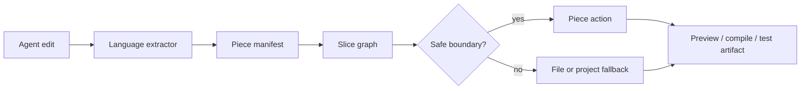

# Piece

[](https://github.com/phodal/piece/actions/workflows/pages.yml)

Build feedback at the size AI agents actually edit.

Piece turns a source file into a graph of functions, classes, types, components, and other semantic pieces. After an agent changes code, Piece can answer the questions that matter:

- which piece changed?
- what downstream pieces are affected?
- which preview, compile, test, or validation artifacts can be reused?
- when should the system fall back to a file-level or project-level build?

Try the live demo: [phodal.github.io/piece](https://phodal.github.io/piece/)

## The Idea

Traditional build systems think in files, targets, actions, and artifacts. That model is still useful, but agent edits are usually smaller than a file.

```text
source file
  -> semantic pieces
  -> impact graph
  -> smallest safe feedback action
  -> reusable artifact or fallback
```

Piece keeps the source file as the storage boundary and makes semantic pieces the feedback boundary.

## Why It Matters

For an editor, preview host, or coding agent, a full rebuild is often too slow and too vague. Piece creates a structured middle layer between language tools and existing build systems:

- faster feedback for small edits;
- explicit dependency and impact reasoning;
- cacheable artifacts tied to piece targets;
- honest fallback when local safety cannot be proven.

Piece is not a replacement for TypeScript, Go, Kotlin, Gradle, Vite, esbuild, or test runners. It is the coordination layer that helps them answer smaller questions.

## How It Works



The core vocabulary is intentionally small:

- `PiecePackage`: the file-level package that owns targets.
- `PieceTarget`: a function, class, type, component, value, or generated DSL target.
- `PieceAction`: the feedback action for a target, such as preview, analysis, compile, or test.
- `PieceArtifact`: the output that can be reused or invalidated.

## What Works Today

- JavaScript, TypeScript, JSX, and TSX piece extraction.
- React preview feedback with virtual modules and incremental rebuild metrics.
- Go extraction through a Node-hosted Go AST analyzer, package-local companion graph edges, explicit current-file target policy for companion declarations, candidate package-scope target models with a safe opt-in selection gate, selected package-view `.pic` output, package-scoped `go list -json` action identity, and single-file `go build` / `go test` feedback.
- Kotlin PSI analysis through the JVM backend, with optional compiler diagnostics and project-model scoped fallback.
- Kotlin compile feedback through Gradle-backed JVM tooling.
- Generated `.pic` metadata, Node-side analysis-level override merging, explicit action/snapshot override mode, package-view-aware override bases, helper-level action package propagation, language compile action selection and dispatch, app-level opt-in compile actions with structured diagnostics, and an ANTLR-backed JVM parser for the same package, target, action, artifact, and per-target source model.
- Action cache identity that includes target source, dependency edges, fallback scope, structured fallback reasons, selected Kotlin source sets, Go `go list` package metadata, Go package source hashes, host compiler options, and dependency artifact hashes.
- Snapshot reconciliation for changed pieces, dirty propagation, reused artifacts, and invalidated artifacts.

React is just one adapter. JS/TS, Go, Kotlin, and `.pic` metadata share the same manifest, graph, action, and artifact model.

## Try It Locally

```sh
npm install
npm run preview
```

Open `http://127.0.0.1:8797` and use `Sample Edit` to watch a piece-level update rebuild only the affected preview path.

## Install

```sh
npm install piece-compiler
```

Node.js 20 or newer is required.

## Repository Map

```text
src/
  core/                 manifest, graph, closure, reconcile, package model
  languages/            JS/TS, Kotlin, and Go extractors
  adapters/react/       React preview adapter

piece-core/
  src/commonMain/       Kotlin MPP model, DSL, graph, reconcile contracts
  src/jvmMain/          Kotlin PSI, diagnostics, Gradle project model, compile backend
  src/jsMain/           npm-facing bridge
  src/wasmJsMain/       browser smoke bridge

docs/
  architecture.md       design model and single-file Bazel mapping
  roadmap.md            Kotlin and .pic roadmap
```

## Development

Use the small checks while iterating:

```sh
npm run typecheck
npm test
npm run preview:build
```

Use the full verification gate before shipping:

```sh
npm run verify
npm run core:check
npm run language:analysis:smoke
npm run language:compile:smoke
npm run pages:build
```

For the deeper architecture and roadmap, see [docs/architecture.md](./docs/architecture.md) and [docs/roadmap.md](./docs/roadmap.md).

## License

Apache-2.0. See [LICENSE](./LICENSE).
